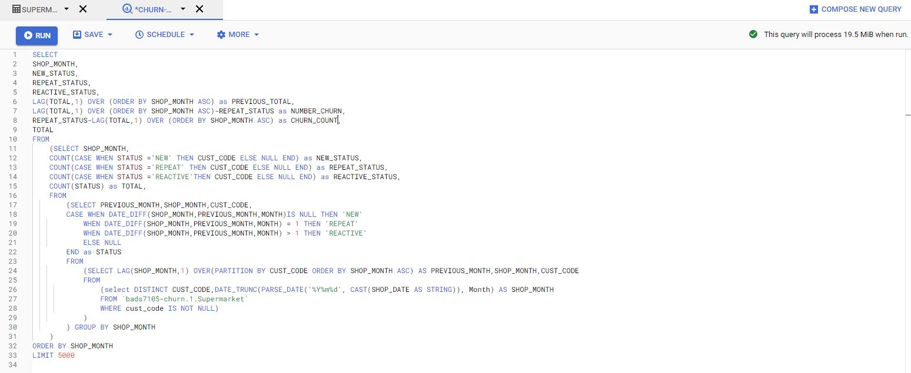
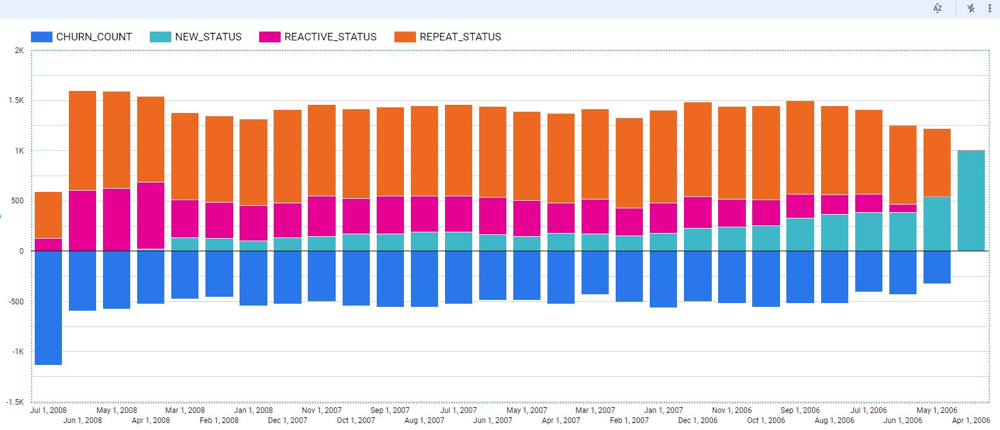

# Churn Analysis
In this assignment, we tried to perform Churn Analysis for customers from April 2006 to July 2018 by query with Google BigQuery (By uploading data from CSV through Google Cloud Storage).

## Query

## Output

## Visualization
Using Google Data Studio to Visualize The output.

